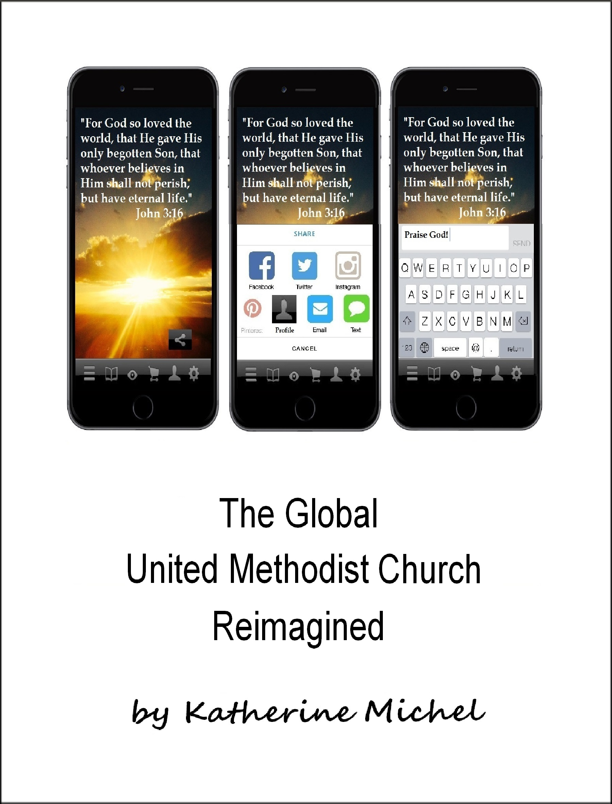

# The Global United Methodist Church Reimagined

A GitBook Documenting a Research and Design Sprint

Table of Contents
* [About](README.md)
* [Introduction](introduction.md)
* [Research Sprint Summary](research-sprint/research-sprint-summary.md)
   * [Lightning Demos Notes](research-sprint/lightning-demos-notes.md)
   * [Google Trends Notes](research-sprint/google-trends-notes.md)
   * [Software and Mobile Eating the World, Global Reorganization Notes](research-sprint/software-and-mobile-eating-the-world,-global-reorganization-notes.md)
* [Design Sprint](design-sprint/design-sprint.md)
* [Prototype](prototype/prototype.md)
* [User Testing](user-testing/user-testing.md)
   * [User Recruiting Process](user-testing/user-recruiting-process.md)
   * [User Testing Setup and Interviews](user-testing/user-testing-setup-and-interviews.md)
* [User Testing Summary](user-testing/user-testing-summary.md)
* [Lessons Learned](lessons-learned.md)
 
GitBook: http://katherinemichel.gitbooks.io/the-global-united-methodist-church-reimagined/content/
  
GitHub repo: https://github.com/KatherineMichel/the-global-united-methodist-church-reimagined

© [Katherine Michel](https://twitter.com/katimichel) 2015-2016

