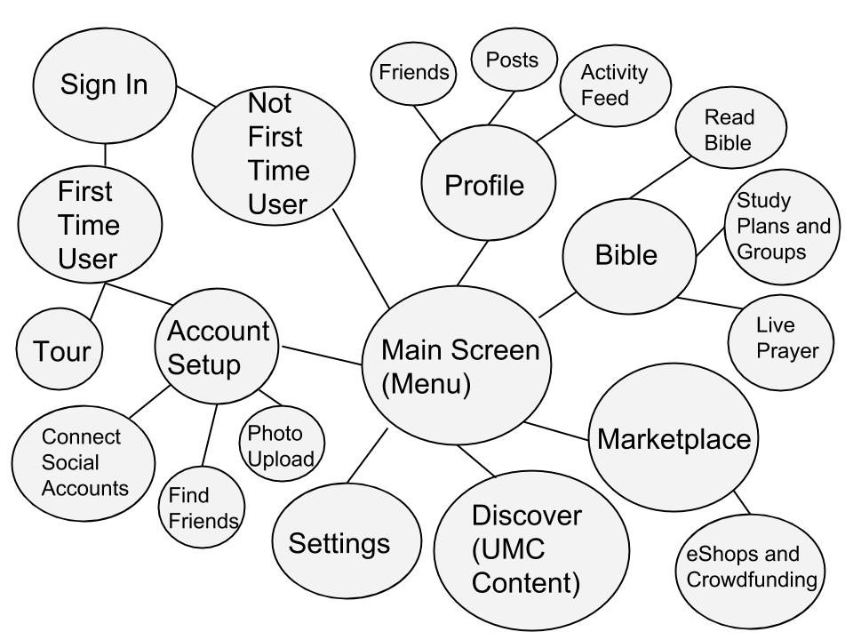
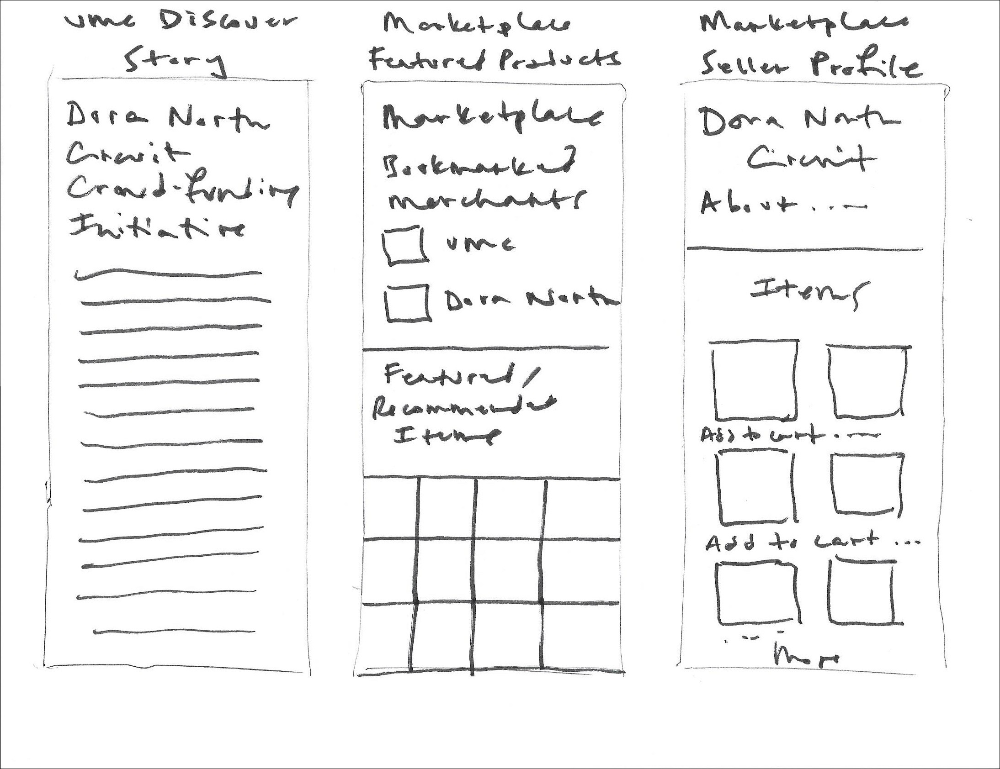

# Design Sprint

## People and Supplies
Taking stock of resources on hand

### [Supplies Needed](http://amzn.com/lm/RS9AYY6BTLDCM)
* Paper
* Sticky notes
* Drawing pens 
* Whiteboard
* Whiteboard markers
* Dot stickers (for voting)
* Sticky stuff
* Timer 
* Snacks 

* And a working space

### People Needed

I did most of the design work alone, and facilitated select problem solving group work, particularly involving the church's Administrative Council Committee and Nurture, Outreach, Witness (NOW) Committee, which both plan outreach for the church. 

## Design Sprint Process

### User Story

#### User Story Task List

* Login and sign up
* Tour (optional)
* Settings
* Main menu
* Profile, news/activity feed, geo-location
* Bible study, groups, live prayer
* Ephemeral scripture messages/setup
* Marketplace (e-shop front, crowdfunding)
* Discover (portal to United Methodist content)

#### User Story Divided into Parts

User Story 1
* Logging in to use profile, Bible, marketplace, UMC portal content

User Story 2
* Logging in as an approved merchant

User Story 3
* Logging in as an admin/volunteer

### Mind map

Mindmap cleaned up using Google Drawing

### Storyboard
What I intended to be Crazy Eights become more like a Storyboard. I felt that after a critique, I could move on to a prototype. 

#### Critique
* Moved settings page to be before find friends and connect social accounts
* Added a Bible study detail page
* Placed Bible verse "ephemeral message"/share after Bible study detail page due to logic of flow (highlighting passage to share)
* Added profile page to show what would look like with shared verse
* Added ephemeral message set up page
* Added Prayer Warriors availability page and moved live prayer after this
* Inserted groups search here
* Added bookmarked groups page, including groups context specific to the user testing participants
* Switched back to main menu instead of Bible study page
* Changed UMC Discover link to a context-specific one

### Prototype

These sketches formed the basis for a Prototype that I made and that can be found in the User Testing section. 
