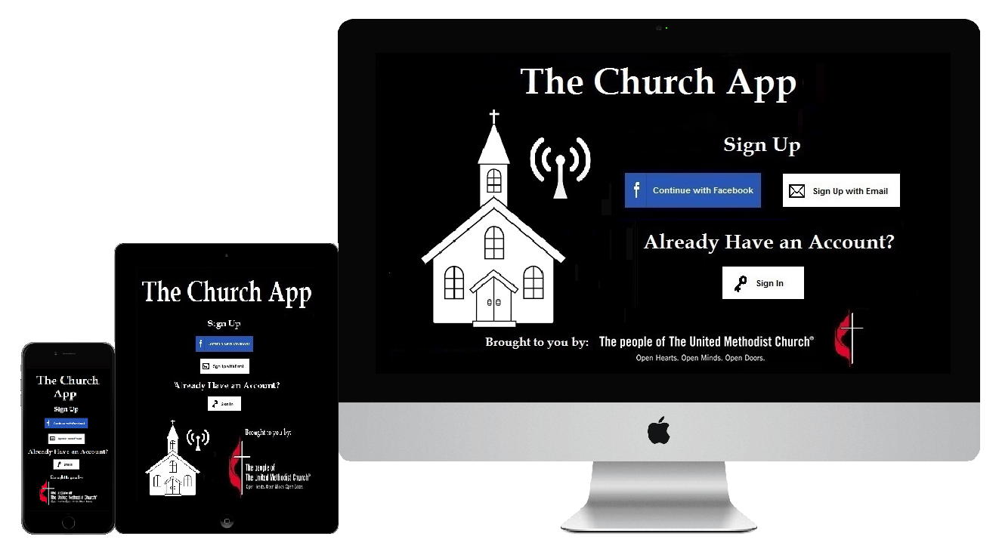
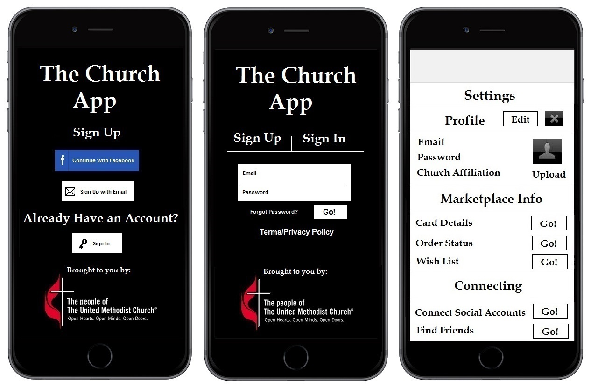
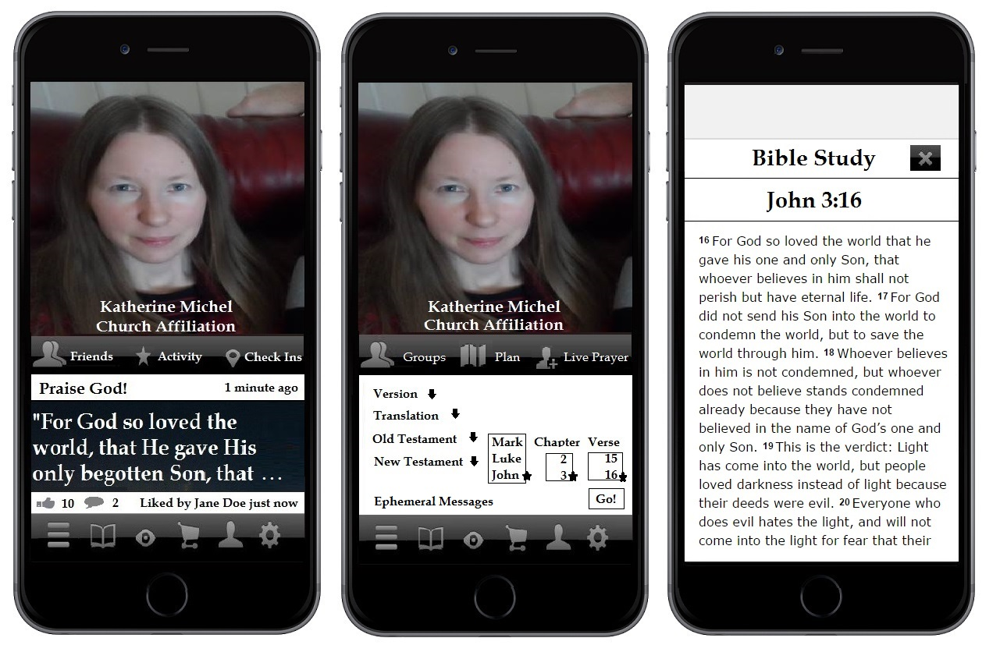
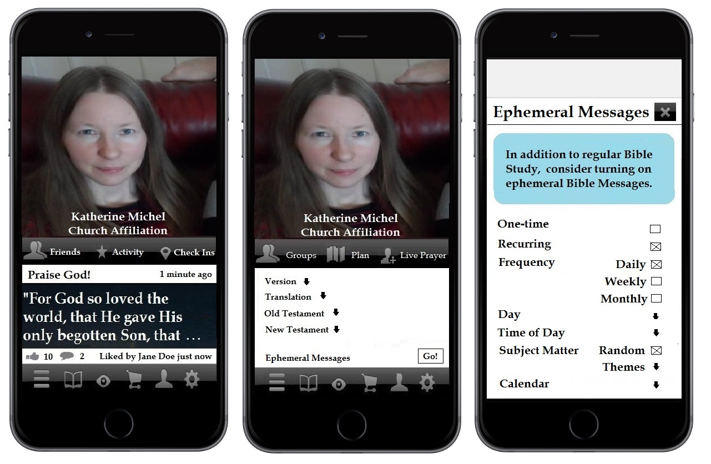
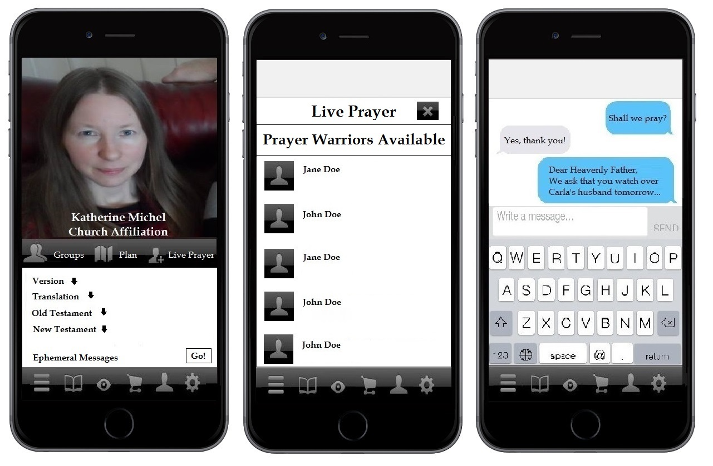

# Prototype

Global United Methodist Church mobile presence re-imagined :)

Prototype as [PowerPoint doc](https://drive.google.com/file/d/0B02bpu7HZwJRU2o1dnZBblVDNFE/view?usp=sharing) or [PDF](https://drive.google.com/file/d/0B02bpu7HZwJRRm92SDU1WUhjMGs/view?usp=sharing)

## Church App responsive design mockup

Church App on iPhone 6+, iPad, Mac

## Church App mobile screen mockups (iPhone 6+)

App homepage, sign up, settings

Connect social accounts, find friends, profile pic upload

Main menu, profile page, activity page

Profile page, Bible study page, Bible study detail

Bible verse with photo background, Bible verse share, posting Bible verse with message

Profile page, Bible study page, ephemeral message set up

Bible study page, Prayer Warrior availability, live prayer

Bible study page, groups search, bookmarked groups

Main menu, marketplace homepage, merchant profile

Main menu, UMC Discover, story detail

Photo credit:
Original, license-free, [MorgueFile](http://www.morguefile.com/archive/display/924868) photo
