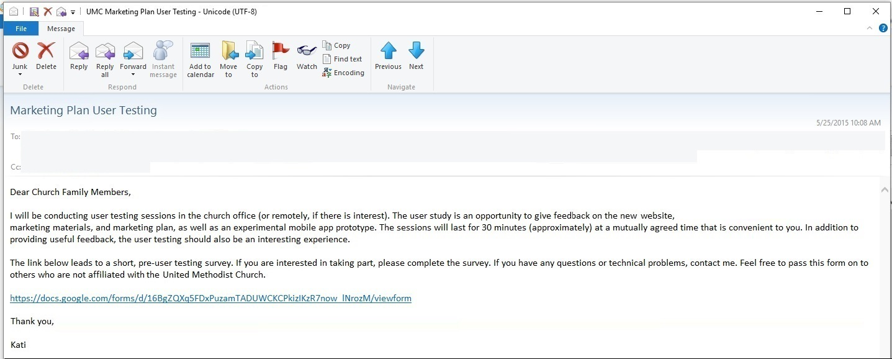
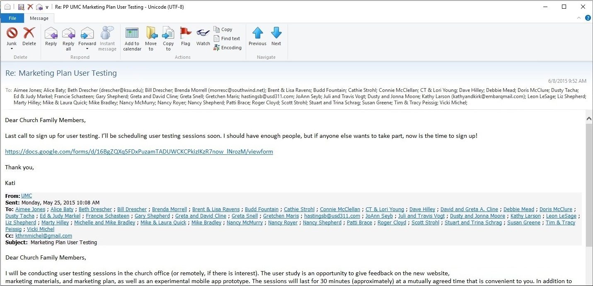
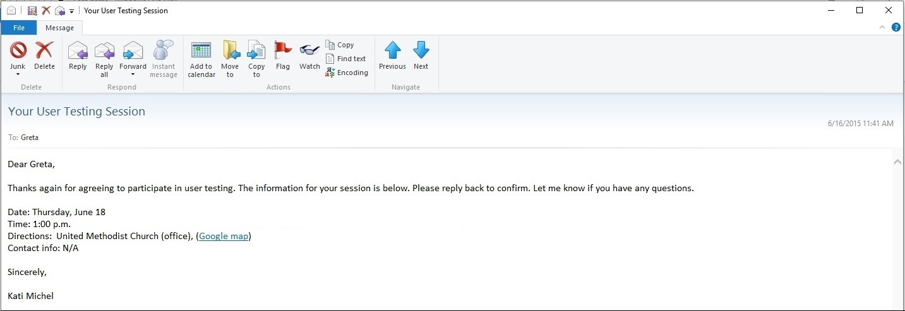

# User Recruiting Process

## Recruiting Screener Worksheet

I filled out the Google Ventures recruiting screener worksheet to prepare for user recruitment

## Recruiting Screener Ad

Google Ventures often uses a Craig's List ad to recruit users. Because members of the United Methodist Church would be the primary users, I sent an email ad to members of the congregation with a link to the [recruiting screener](https://docs.google.com/forms/d/16BgZQXq5FDxPuzamTADUWCKCPkizIKzR7now_lNrozM/viewform?usp=send_form). 

Email ad with link to the recruiting screener

Follow up email for stragglers

## Recruiting Screener

I used [Google Forms](https://support.google.com/docs/answer/87809?hl=en) to create the [recruiting screener](https://docs.google.com/forms/d/16BgZQXq5FDxPuzamTADUWCKCPkizIKzR7now_lNrozM/viewform?usp=send_form). The results were automatically collected in a spreadsheet in Google Drive. 

## Contacting Prospective Users

### Phone Call

After reviewing the recruiting screener responses automatically collected in a spreadsheet in Google Drive, I chose prospective user testing participants and called each one to confirm participation. 

### Confirmation Email

After the phone calls, I sent each confirmed participant a confirmation email. In each email I included:

* Date
* Time
* Directions
* Contact info
* NDA (if needed)
* A request that prospective users reply to confirm

Example confirmation email

Though Google Ventures suggests including in the email a link to a non-disclosure agreement, I did not feel that one was needed for this situation. 
