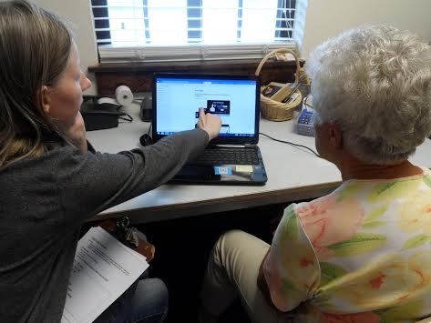
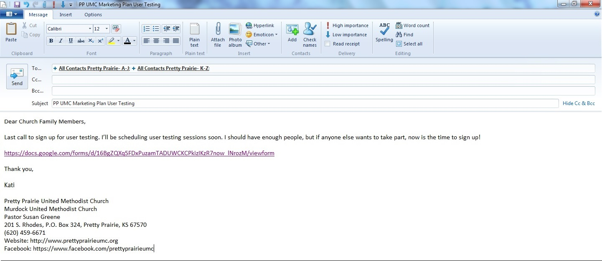
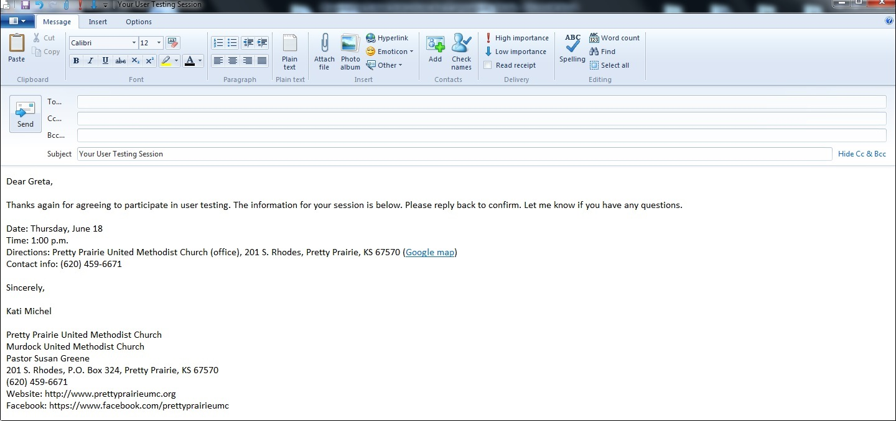
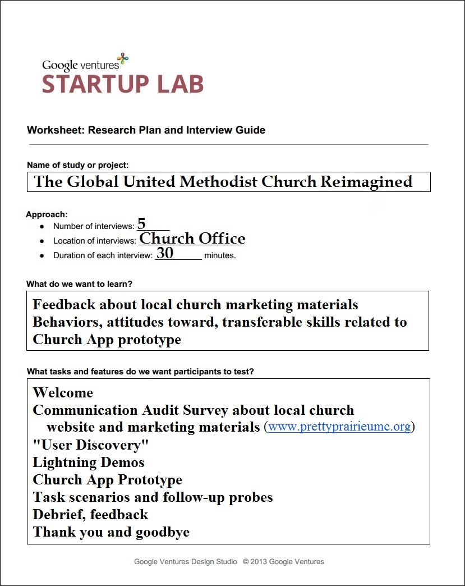
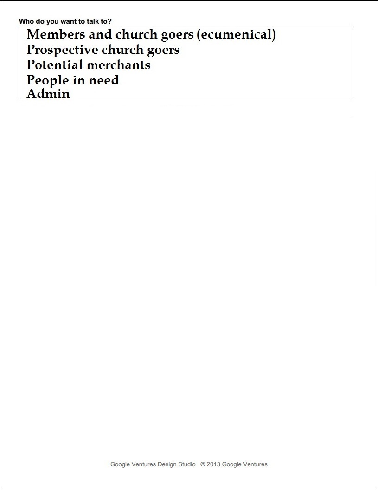
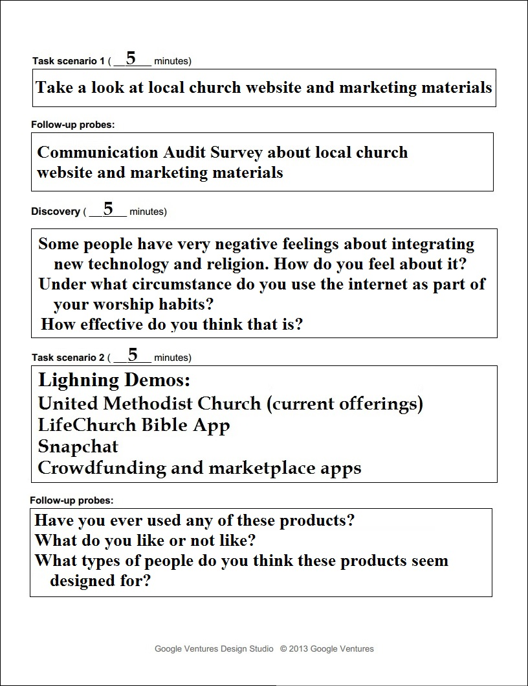
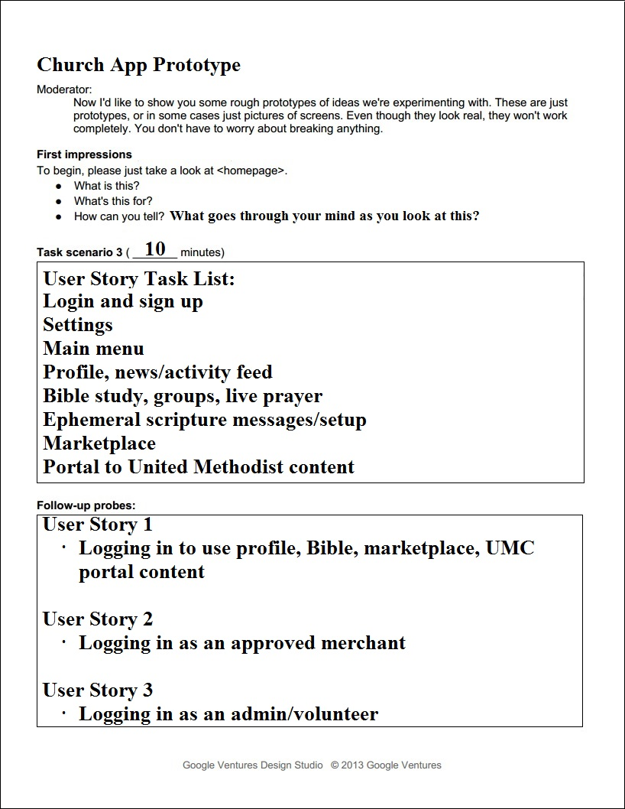
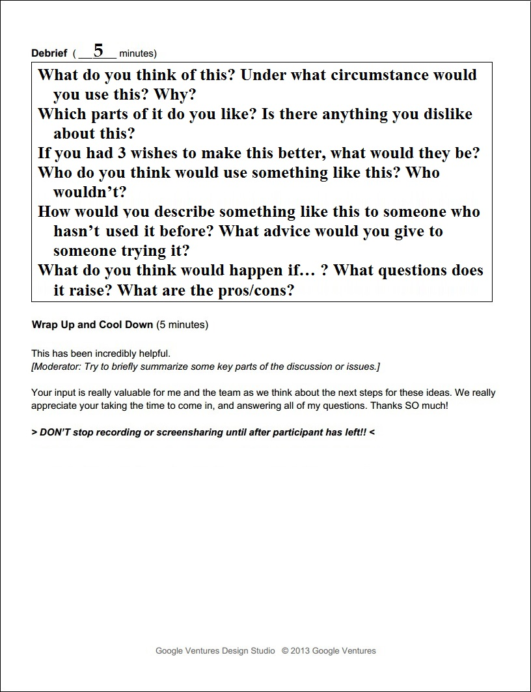

# User Testing

Conducting user testing

## User Recruiting Process

## Recruiting Screener Worksheet

I filled out the Google Ventures [Recruiting Screener Worksheet](http://www.gv.com/wp-content/uploads/2014/07/Google-Ventures-Research-Sprint-Screener-Worksheet.pdf) to prepare for user recruitment

## Recruiting Screener Ad
Google Ventures often uses a [Craig's List ad](http://www.gv.com/wp-content/uploads/2014/07/Google-Ventures-Research-Sprint-Sample-Craigslist-ad.png) to recruit users. Because members of the United Methodist Church would be the primary users, I sent an email ad to members of the congregation with a link to the [Recruiting Screener](https://docs.google.com/forms/d/16BgZQXq5FDxPuzamTADUWCKCPkizIKzR7now_lNrozM/viewform?usp=send_form). 

Email Ad with link to [Recruitment Screener](https://docs.google.com/forms/d/16BgZQXq5FDxPuzamTADUWCKCPkizIKzR7now_lNrozM/viewform?usp=send_form)

Follow Up Email for stragglers

## Recruiting Screener
I used [Google Forms](https://support.google.com/docs/answer/87809?hl=en) to create the [Recruiting Screener](https://docs.google.com/forms/d/16BgZQXq5FDxPuzamTADUWCKCPkizIKzR7now_lNrozM/viewform?usp=send_form). The results were automatically collected in a spreadsheet in Google Drive. 

## Contacting Prospective Users

### Phone Call
After reviewing the Recruiter Screener responses automatically collected in a spreadsheet in Google Drive, I chose prospective user testing participants and called each one to confirm participation. 

### Confirmation Email

After the phone calls, I sent each confirmed participant a confirmation email. In each email I included:

* Date
* Time
* Directions
* Contact info
* NDA (if needed)
* A request that prospective users reply to confirm

Example Confirmation Email

Though Google Ventures suggests including in the email a link to a non-disclosure agreement ([Google Ventures Example Non-Disclosure Agreement](http://www.gv.com/wp-content/uploads/2014/07/Google-Ventures-Research-Sprint-Sample-NDA.pdf)), I did not feel that one was needed for this situation. 

## User Interviews

The user testing interviews would be done using the [Prototype](prototype.md) that was the end result of my Design Sprint. 

### Testing Setup

* Cleaned desk, computer, screen
* Removed extraneous files from computer destop 
* Moved prototype file to desktop
* Did a test run of prototype
* Opened lightning demo and mobile app use case links in a browser
* Printed interview guide and placed in clipboard alongside notepad and pen
* Cleaned room
* After each interview, reset testing setup, including prototype

### High Level Agenda 

High Level Agenda and Interview Guide info as a [Word doc](https://drive.google.com/file/d/0B02bpu7HZwJRSkh5bGVzVXZTQ28/view?usp=sharing) or [PDF](https://drive.google.com/file/d/0B02bpu7HZwJRaWN1UEdVNU1hMkk/view?usp=sharing)

* Welcome
* Communication Audit Survey about local church marketing materials
* "User Discovery"
* Lightning Demos
* Church App Prototype
* Task scenarios and follow-up probes
* Debrief, feedback
* Thank you and goodbye

### Interview Guide 

I used Google Ventures ["User Research, Quick 'n' Dirty,"](http://www.gv.com/wp-content/uploads/2013/02/User-Research-Workshop_Google-Ventures_Feb2013.pdf) as an interview planning resource.

#### Example Mobile App Use Case

As part of the interviews, I would use a hypothetical scenario that would involve the church where the interviews were taking place (Pretty Prairie United Methodist Church) and one of Pretty Prairie United Methodist Church's mission projects: Dora North Circuit in Mutare District of Zimbabwe. 

Information sheet about [Dora North Circuit, Zimbabwe](https://drive.google.com/file/d/0B02bpu7HZwJRM2UyVXpRcm9hMkE/view?usp=sharing)
 (use magnifying glass icon to zoom)

Article [Benefits of the Chabadza Partnerships Between the Great Plains Conference – Wichita West District & the Zimbabwe East Conference – Mutasa Nyanga District](http://www.greatplainsumc.org/newsdetail/1095566)

Article as [Word doc](https://drive.google.com/file/d/0B02bpu7HZwJRSDhTdXp3akUyX28/view?usp=sharing) or [PDF](https://drive.google.com/file/d/0B02bpu7HZwJRLW8yVG1iMnNiaDQ/view?usp=sharing)

### User Testing Summary Report

#### Participant Information Summary Table

|  | Participant 1 | Participant 2 | Participant 3 | Participant 4 | Participant 5 | 
| -- | -- | -- | -- |
| Gender | Female | Female | Female |Female | Female | 
| Age | 76 | 66 | 61 | 64 | 62 | 
| Do you work in tech or are a tech expert of some type? | No  | No  | No  | No | No | 
| If you do work in tech/are a tech expert, in what subject or role? | N/A  | N/A  | N/A  | N/A | N/A | 
| Do you currently attend a church and/or read the Bible? (This can be any church that uses the Bible.) | Yes  | Yes  | Yes  | Yes | Yes | 
| Are you unaffiliated with a church, but interested in Christian resources via web and/or mobile? | No  | No  | No  | No | No |
| Do you sell goods that promote fair-trade, sustainability?  | No  | No  | No  | No | No |
| Are you sometimes in need of/willing to offer spiritual guidance/a helping hand and willing to receive/offer this virtually? | Yes  | Yes  | Yes  | Yes | Yes | 
| Do you have website/app admin experience? | No  | No  | No  | No | No |
| What would be the most convenient time for you take part in a 30 minute (approximately)  user testing session? | Afternoon, Evening  | Afternoon  | Anytime  | Afternoon | Weekend |

#### Participant Data Summary Table

##### Discovery Questions

|  | Participant 1 | Participant 2 | Participant 3 | Participant 4 | Participant 5 | 
| -- | -- | -- | -- |
| Some people have very negative feelings about integrating new technology and religion. How do you feel about it? | Neutral | Neutral | Neutral | Neutral | Neutral |
| Under what circumstance do you use the internet as part of your worship habits? |  |  |  |  |  |
| How effective do you think that is? |  |  |  |  |  |

##### Lightning Demos
United Methodist Church (www.umc.org)
LifeChurch Bible App (www.bible.com)
Snapchat (www.snapchat.org)
Crowdfunding and marketplace apps (www.kickstarter.com)

##### Lightning Demo Questions

|  | Participant 1 | Participant 2 | Participant 3 | Participant 4 | Participant 5 | 
| -- | -- | -- | -- |
| Do you use the UMC website? | When has specific reason | When has specific reason | When has specific reason | When has specific reason | When has specific reason |
| Have you ever used any of the other lightning demo products (Bible App, Snapchat, Crowdfunding)? | Had not heard of any of them |  | Has heard of Snapchat, LifeChurch, crowdfunding, but not used |  |  |
| What types of people do you think these products seem designed for? |  |  | Wide variety, such as retirees |  |  |

##### Debrief Questions

|  | Participant 1 | Participant 2 | Participant 3 | Participant 4 | Participant 5 | 
| -- | -- | -- | -- |
| What do you think of this? Under what circumstance would you use this? Why?  |  |  | "In love with it," would use |  |  |
| Which parts of it do you like? |  | Marketplace | Prayer Warriors, Marketplace, church geo-location, daily scripture messages, Bible study |  |  |
| Is there anything you dislike about this?/If you had 3 wishes to make this better, what would they be? | No answer given | No answer given | Would not use social media part | No answer given | No answer given |
| Who do you think would use something like this? Who wouldn’t?   | Leaders networking, disaster relief, people finding one another for special projects |  | Disaster relief, scripture reading, General Conference report updates |  |  |
| How would you describe something like this to someone who hasn’t used it before? What advice would you give to someone trying it?   | General description | "Church at your fingertips" | General description  | General description  | General description |
| What do you think would happen if... ? What questions does it raise? What are the pros/cons? | Con: reluctance to try it |  | People who don't want to use it just don't have to; people might want/need instructions; does not think would have negative effect on attendance |  |  |

### Thank You Email with Optional Feedback Survey
